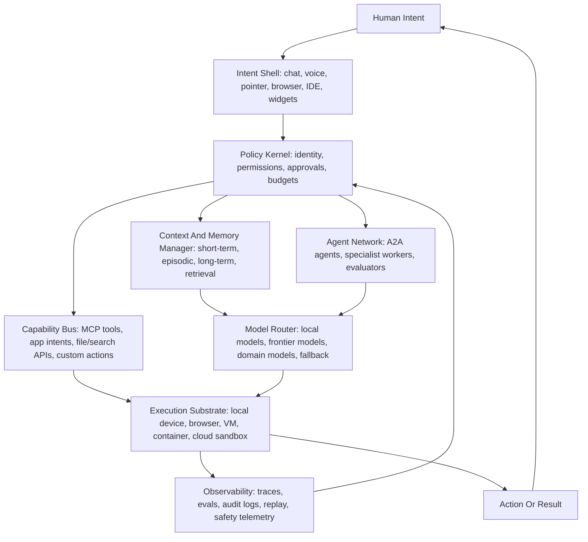

# AI OS Research 2026

Research date: May 17, 2026  
Mode: Mythic Engineering active - Scribe artifact for project memory  
Scope: Current market, technical, and strategic research on "AI OS" as a consumer platform, agent runtime, protocol layer, and operating-systems research direction.

## Executive Thesis

"AI OS" is no longer a single clear category. As of May 2026, it is a contested phrase covering four overlapping movements:

1. Traditional operating systems gaining native AI runtimes, local models, privacy controls, and ambient UI surfaces.
2. Agent platforms becoming operating layers for work by coordinating memory, tools, apps, browsers, files, and human approvals.
3. Open protocols becoming the "device drivers" and "network stack" of the agent era.
4. Research systems trying to define true operating-system primitives for agent execution, scheduling, memory, observability, trust, and resource control.

The strongest pattern: an AI OS is not simply an OS with a chatbot. It is a control plane for intent. It translates human goals into safe, observable, policy-bound actions across models, tools, apps, data, and devices.

## Latest Signal Summary

The newest major consumer signal came from Google on May 12, 2026. Google described Android as moving from an operating system toward an "intelligence system," introduced Gemini Intelligence for Android, and announced Googlebook, a laptop category built around Gemini Intelligence and a new Android/ChromeOS-derived AI-first experience. Sources: [Google Gemini Intelligence on Android](https://blog.google/products-and-platforms/platforms/android/gemini-intelligence/), [Googlebook announcement](https://blog.google/products-and-platforms/platforms/android/meet-googlebook/), [googlebook.google](https://googlebook.google/).

Microsoft is building AI into Windows through Copilot+ PCs, Windows AI components, Windows AI APIs, Phi Silica, Windows ML, Recall, Click to Do, improved search, and Windows AI Foundry. Sources: [Windows Copilot+ AI components](https://support.microsoft.com/en-us/topic/windows-copilot-ai-components-a9ef14e9-32a7-497f-b780-7b6fb63af793), [Copilot+ PC AI features](https://blogs.windows.com/windowsexperience/2025/04/25/copilot-pcs-are-the-most-performant-windows-pcs-ever-built-now-with-more-ai-features-that-empower-you-every-day/), [Windows ML GA](https://blogs.windows.com/windowsdeveloper/2025/09/23/windows-ml-is-generally-available-empowering-developers-to-scale-local-ai-across-windows-devices/), [Windows AI APIs](https://learn.microsoft.com/en-za/windows/ai/apis/).

Apple is pursuing the privacy-preserving, local-first path: Apple Intelligence is integrated across iPhone, iPad, Mac, Vision Pro, and Watch surfaces; the Foundation Models framework exposes a roughly 3B-parameter on-device model, guided generation, and tool calling to developers; Private Cloud Compute extends Apple silicon-style trust into cloud inference. Sources: [Apple Foundation Models framework](https://www.apple.com/newsroom/2025/09/apples-foundation-models-framework-unlocks-new-intelligent-app-experiences/), [Apple Foundation Models tech report 2025](https://machinelearning.apple.com/research/apple-foundation-models-tech-report-2025), [Apple Private Cloud Compute](https://security.apple.com/com/blog/private-cloud-compute/), [Apple Intelligence support](https://support.apple.com/en-us/121115).

OpenAI and Anthropic are moving AI from conversation into computer and app control. OpenAI has the Responses API, built-in web/file/computer tools, Apps SDK, Agents SDK, and ChatGPT apps built on MCP. Anthropic has Claude computer use and donated MCP into the Linux Foundation's Agentic AI Foundation. Sources: [OpenAI new tools for building agents](https://openai.com/index/new-tools-for-building-agents/), [OpenAI computer use guide](https://developers.openai.com/api/docs/guides/tools-computer-use), [OpenAI Apps SDK announcement](https://openai.com/index/introducing-apps-in-chatgpt/), [Anthropic computer use tool](https://platform.claude.com/docs/en/agents-and-tools/tool-use/computer-use-tool), [Anthropic MCP donation](https://www.anthropic.com/news/donating-the-model-context-protocol-and-establishing-of-the-agentic-ai-foundation).

The open standards layer is hardening quickly. The Linux Foundation announced the Agentic AI Foundation in December 2025 with MCP, goose, and AGENTS.md as founding projects. In April 2026, A2A announced major adoption milestones and positioned itself as complementary to MCP: A2A for agent-to-agent coordination, MCP for tools and data. Sources: [Linux Foundation AAIF announcement](https://www.linuxfoundation.org/press/linux-foundation-announces-the-formation-of-the-agentic-ai-foundation?hs_amp=true), [A2A one-year milestone](https://www.linuxfoundation.org/press/a2a-protocol-surpasses-150-organizations-lands-in-major-cloud-platforms-and-sees-enterprise-production-use-in-first-year), [MCP specification](https://modelcontextprotocol.io/specification/2025-03-26/index).

The research frontier is explicitly OS-shaped. AIOS, MemoryOS, VFMOS/FM OS, Qualixar OS, AI Trust OS, OSWorld, and new security work are all converging on OS metaphors: kernel, scheduler, memory manager, tool manager, trust agent, virtualization layer, telemetry layer, and sandbox. Sources: [AIOS paper](https://arxiv.org/abs/2403.16971), [MemoryOS paper](https://arxiv.org/abs/2506.06326), [VFMOS](https://vfmos.net/), [AgenticOS workshop](https://os-for-agent.github.io/), [Qualixar OS](https://arxiv.org/abs/2604.06392), [AI Trust OS](https://arxiv.org/abs/2604.04749), [Toward Securing AI Agents Like Operating Systems](https://arxiv.org/abs/2605.14932), [OSWorld](https://proceedings.neurips.cc/paper_files/paper/2024/hash/5d413e48f84dc61244b6be550f1cd8f5-Abstract-Datasets_and_Benchmarks_Track.html).

## Working Definition

An AI OS is a durable system layer that:

- understands user intent;
- manages model selection, context, memory, tools, agents, and actions;
- exposes stable capability interfaces to apps and agents;
- enforces identity, permissions, policies, budgets, and human approvals;
- records what happened for audit, debugging, and trust;
- runs across local devices, browsers, cloud sandboxes, enterprise data, and specialized hardware.

This definition is broader than a desktop operating system and stricter than a chatbot. It treats AI as an operating layer with responsibilities similar to process management, memory management, I/O, security, scheduling, and observability.

## Market Map

| Layer | What It Controls | Current Examples | Maturity | Strategic Meaning |
|---|---|---|---|---|
| Device AI OS | Local models, NPUs, UI surfaces, privacy, files, screen context | Windows Copilot+ PCs, Apple Intelligence, Android Gemini Intelligence, Googlebook | Production to near-term rollout | Incumbent OS vendors are turning distribution and hardware integration into AI advantage. |
| Agent Runtime OS | Tool use, web/file/computer actions, orchestration, evals, hosted sandboxes | OpenAI Responses/Agents SDK, Anthropic computer use, Copilot Studio, Azure AI Foundry Agent Service, Google Antigravity | Fast-moving platform layer | Chat products, IDEs, and enterprise platforms are becoming task execution environments. |
| Protocol OS | Tool connectors, agent-to-agent communication, repository guidance, app surfaces | MCP, A2A, AGENTS.md, OpenAI Apps SDK | Rapidly standardizing | Protocols may become the USB/TCP/IP layer of agent ecosystems. |
| Vertical AI OS | Domain-specific agent governance and workflow execution | Fiserv agentOS for banking; emerging engineering/manufacturing AI OS products | Early enterprise rollout | Regulated industries want agent control planes with policy, auditability, and human oversight. |
| Research AI OS | Kernel abstractions, scheduling, memory, trust, model virtualization, benchmarks | AIOS, MemoryOS, VFMOS/FM OS, OSWorld, AI Trust OS, Qualixar OS | Research and pre-production | The field is trying to name the primitives that production systems are already improvising. |

## Timeline: How The Category Formed

### 2024

- Apple introduced Apple Intelligence as a personal intelligence system deeply integrated into iOS, iPadOS, and macOS, combining on-device and Private Cloud Compute-backed models.
- Microsoft introduced Copilot+ PCs and Recall, setting the AI PC direction around local NPUs, screen history, semantic search, and OS-integrated AI.
- Anthropic introduced MCP as a standard way for AI apps to connect to external tools and data.
- OSWorld showed that computer-use agents were still weak in real operating-system environments: humans completed more than 72% of benchmark tasks, while the best evaluated model reached only 12.24% at that time.
- AIOS proposed an LLM-agent operating system kernel with scheduling, context management, memory management, storage, access control, and SDK interfaces.

### 2025

- Microsoft moved Recall, Click to Do, and improved Windows Search toward general availability on Copilot+ PCs, with local processing and opt-in controls emphasized.
- Apple opened the Foundation Models framework so developers could call the on-device Apple Intelligence model, use guided generation, and use tool calling inside apps.
- Windows AI Foundry and Windows ML matured the Windows local AI runtime story.
- A2A became a Linux Foundation-hosted project for agent-to-agent coordination.
- The Linux Foundation launched the Agentic AI Foundation, with MCP, goose, and AGENTS.md as founding projects.
- OpenAI and Anthropic accelerated computer-use and app-platform models for agents.

### 2026 To Date

- Google announced Gemini Intelligence for Android and Googlebook. This is the clearest public claim that the device OS is turning into an intelligence system.
- A2A reported production-ready status, more than 150 supporting organizations, and integrations across Google, Microsoft, and AWS platforms.
- Fiserv announced agentOS for banking, expected to be widely available by August 2026, with OpenAI and AWS named as collaborators.
- Copilot Studio computer use is planned for May 2026 general availability, enabling agents to operate GUIs when APIs are unavailable.
- Security research has explicitly argued that agents should be secured like operating systems.
- FMOS/VFMOS research is pushing foundation model virtualization: a stable "virtual model" abstraction backed by dynamic data, model, and trust subsystems.

## Consumer And Device OS Direction

### Microsoft: Windows As Local AI Runtime

Microsoft's AI OS strategy is hardware-plus-runtime. Copilot+ PCs provide the NPU baseline; Windows AI components are serviced separately from core Windows features; Phi Silica supplies a local NPU-tuned small language model; Windows ML provides a production inference runtime across CPU, GPU, and NPU; and Windows AI APIs expose capabilities such as text, OCR, imaging, object erase, and semantic search.

Strategically, Microsoft is trying to make Windows a broad local AI substrate. The important detail is not any one feature. It is the servicing model: AI components can update independently, and developers can target local AI APIs rather than ship every model/runtime themselves.

Key sources:

- [Windows Copilot+ AI components](https://support.microsoft.com/en-us/topic/windows-copilot-ai-components-a9ef14e9-32a7-497f-b780-7b6fb63af793)
- [Windows AI APIs](https://learn.microsoft.com/en-za/windows/ai/apis/)
- [Phi Silica in Windows App SDK](https://learn.microsoft.com/en-au/windows/ai/apis/phi-silica)
- [Windows ML generally available](https://blogs.windows.com/windowsdeveloper/2025/09/23/windows-ml-is-generally-available-empowering-developers-to-scale-local-ai-across-windows-devices/)

### Apple: Private, Local, Framework-Centric Intelligence

Apple's AI OS strategy is privacy-plus-developer-framework. Apple Intelligence runs across device surfaces and uses both on-device models and server models. The 2025 model report describes a roughly 3B-parameter on-device model and a server-side model designed for Private Cloud Compute. The Foundation Models framework exposes on-device intelligence through Swift with guided generation, tool calling, and LoRA adapter fine-tuning.

The architectural signal is Apple's effort to turn privacy into a system primitive. Private Cloud Compute is not just "cloud AI." It is a cloud extension of device security: stateless processing, no privileged access to user data, cryptographic transparency, and custom Apple silicon nodes.

Key sources:

- [Apple Foundation Models framework](https://www.apple.com/newsroom/2025/09/apples-foundation-models-framework-unlocks-new-intelligent-app-experiences/)
- [Apple Foundation Models tech report 2025](https://machinelearning.apple.com/research/apple-foundation-models-tech-report-2025)
- [Private Cloud Compute](https://security.apple.com/com/blog/private-cloud-compute/)
- [Apple Intelligence support matrix](https://support.apple.com/en-us/121115)

### Google: Android Becomes The Intelligence System

Google's May 2026 announcements are the most explicit AI OS language in the consumer market. Gemini Intelligence for Android includes app automation, screen/image context, autofill intelligence, Chrome summarization/comparison, Chrome auto browse, Gboard speech cleanup, and broader device rollout. Googlebook extends this into laptops with Magic Pointer, prompt-created widgets, Android phone integration, and a hardware partner ecosystem.

This is an attempt to move AI from an app into the operating experience itself. The cursor, browser, autofill, widgets, notifications, and phone/laptop bridge become AI surfaces.

Key sources:

- [Gemini Intelligence on Android](https://blog.google/products-and-platforms/platforms/android/gemini-intelligence/)
- [Gemini in Chrome with auto browse on Android](https://blog.google/products-and-platforms/products/chrome/bringing-chrome-ai-to-android/)
- [Googlebook announcement](https://blog.google/products-and-platforms/platforms/android/meet-googlebook/)
- [Googlebook product page](https://googlebook.google/)
- [Gemini 3 and Google Antigravity](https://blog.google/products-and-platforms/products/gemini/gemini-3/)

## Agent Platform Direction

### OpenAI: ChatGPT As App Surface And Agent Runtime

OpenAI's agent platform has three OS-like moves:

- The Responses API consolidates model calls with built-in tools such as web search, file search, and computer use.
- Computer use turns GUI control into a model tool loop: task, action proposal, execute actions, capture screen, repeat.
- Apps in ChatGPT use the Apps SDK, built on MCP, so third-party apps can expose logic and interfaces inside ChatGPT.

This makes ChatGPT resemble an application shell: users express intent conversationally; apps and tools become callable capabilities; the model mediates interaction and action.

Key sources:

- [OpenAI new tools for building agents](https://openai.com/index/new-tools-for-building-agents/)
- [OpenAI computer use guide](https://developers.openai.com/api/docs/guides/tools-computer-use)
- [OpenAI Apps SDK announcement](https://openai.com/index/introducing-apps-in-chatgpt/)

### Anthropic: Computer Use And MCP Standardization

Anthropic's computer use tool lets Claude interact with desktop environments through screenshots, mouse, keyboard, and an agent loop. The official docs emphasize sandboxed environments, prompt injection risks, and isolation from sensitive data/actions.

Anthropic's bigger ecosystem move is MCP. By donating MCP to the Agentic AI Foundation, Anthropic moved a core integration protocol into neutral governance. That matters because AI OS architecture depends on standard ways to expose tools, data, and permissions to agents.

Key sources:

- [Anthropic computer use tool](https://platform.claude.com/docs/en/agents-and-tools/tool-use/computer-use-tool)
- [Anthropic MCP donation](https://www.anthropic.com/news/donating-the-model-context-protocol-and-establishing-of-the-agentic-ai-foundation)
- [MCP specification](https://modelcontextprotocol.io/specification/2025-03-26/index)

### Microsoft Enterprise Agents: Copilot Studio And Foundry

Microsoft is turning Copilot into an enterprise agent platform. Copilot Studio now includes model choice, evaluations, MCP integration, multi-agent orchestration, identity improvements, activity maps, audit logging, session replay, and computer use. Azure AI Foundry Agent Service supports multi-agent orchestration and both A2A and MCP.

The enterprise AI OS pattern is visible here: models are not enough. Enterprises need identity, governance, observability, versioning, tool catalogs, test sets, rollback, and human input.

Key sources:

- [Microsoft Build 2025 agent platform overview](https://blogs.microsoft.com/blog/2025/05/19/microsoft-build-2025-the-age-of-ai-agents-and-building-the-open-agentic-web/)
- [Copilot Studio computer use release plan](https://learn.microsoft.com/en-us/power-platform/release-plan/2026wave1/microsoft-copilot-studio/automate-web-desktop-apps-computer-use)
- [What's new in Copilot Studio](https://learn.microsoft.com/en-us/microsoft-copilot-studio/whats-new)

## Protocol Layer: The Emerging AI OS Bus

### MCP

MCP standardizes how AI applications connect to external tools, data, and systems. It is best understood as an integration bus for agent capabilities.

Why it matters:

- It reduces custom one-off integrations.
- It lets tools become discoverable and callable.
- It gives agent platforms a shared connector model.
- It creates a security and governance surface that can be standardized.

### A2A

A2A standardizes how agents discover, communicate, delegate, and coordinate across frameworks and organizations. Linux Foundation materials position A2A as complementary to MCP: A2A connects agents to agents; MCP connects agents to tools and data.

Why it matters:

- Multi-agent systems need discovery, identity, negotiation, and communication.
- Cross-vendor enterprise automation cannot scale on custom glue.
- Agentic commerce and transactions require cryptographic consent and audit trails.

### AGENTS.md

AGENTS.md gives coding agents project-specific instructions in a repository. It seems small, but it is OS-like in practice: a local policy and behavior file for agents entering a workspace.

In this project, the user-provided AGENTS instructions already define Mythic Engineering roles and operating expectations. That makes the project itself more agent-ready.

## Research Frontier

### AIOS: Kernel For LLM Agents

AIOS proposes isolating resources and LLM-specific services into an AIOS kernel. Its kernel responsibilities include scheduling, context management, memory management, storage management, and access control. It also provides an SDK for agent developers. The paper reports up to 2.1x faster execution for serving agents across frameworks.

Interpretation: AIOS is the cleanest early academic articulation of "agent OS" as a kernel/service boundary.

Source: [AIOS: LLM Agent Operating System](https://arxiv.org/abs/2403.16971)

### MemoryOS: Memory Manager For Agents

MemoryOS treats agent memory like an OS hierarchy: short-term, mid-term, and long-term personal memory, with update/retrieval/generation modules. It is narrower than a full AI OS, but it names one of the most important subsystems.

Interpretation: durable AI OS systems need memory as a managed resource, not a prompt string.

Source: [Memory OS of AI Agent](https://arxiv.org/abs/2506.06326)

### VFMOS/FM OS: Virtualizing Foundation Models

VFMOS and related FMOS work propose a virtualization layer for foundation models. Instead of each app directly managing prompts, routing, context windows, tools, and verification, the operating layer provides a virtual model abstraction backed by:

- a Data Agent for context and knowledge;
- a Model Optimizer for routing, composition, distillation, and adaptation;
- a Trust Agent for verification, reasoning depth, and policy enforcement.

Interpretation: this is the closest research analogy to virtual memory or a VM monitor for AI. Apps specify intent and constraints; the system chooses the physical model, context, verification, and budget path.

Sources: [VFMOS](https://vfmos.net/), [AgenticOS paper PDF](https://os-for-agent.github.io/papers/AgenticOS_2026_paper_26.pdf)

### OSWorld And OSWorld-Human: Reality Check For Computer Use

OSWorld created real desktop/web tasks across Ubuntu, Windows, and macOS-style environments. The original benchmark exposed major capability gaps. OSWorld-Human later showed that even strong computer-use agents may take 1.4x to 2.7x more steps than necessary, with high latency from planning/reflection calls.

Interpretation: GUI agents are improving, but usable AI OS behavior depends on speed, grounding, error recovery, and fewer unnecessary loops.

Sources: [OSWorld](https://proceedings.neurips.cc/paper_files/paper/2024/hash/5d413e48f84dc61244b6be550f1cd8f5-Abstract-Datasets_and_Benchmarks_Track.html), [OSWorld-Human](https://arxiv.org/abs/2506.16042)

### AI Trust OS And Security Like Operating Systems

AI Trust OS proposes continuous governance through telemetry, observability, probes, and zero-trust compliance. "Toward Securing AI Agents Like Operating Systems" argues that agent systems should borrow OS security techniques because agents increasingly execute code, call tools, browse the web, and manipulate user data.

Interpretation: trust, audit, and security are not add-ons. They are AI OS kernel responsibilities.

Sources: [AI Trust OS](https://arxiv.org/abs/2604.04749), [Toward Securing AI Agents Like Operating Systems](https://arxiv.org/abs/2605.14932)

### Qualixar OS: Ambitious Application-Layer Agent OS

Qualixar OS is a 2026 preprint proposing an application-layer operating system for heterogeneous multi-agent orchestration across LLM providers, agent frameworks, transports, model routing, consensus judging, content attribution, MCP/A2A compatibility, and dashboard tooling.

Interpretation: useful as a signal of where builders think the category is going, but it should be treated as early research/preprint evidence rather than established production proof.

Source: [Qualixar OS](https://arxiv.org/abs/2604.06392)

## Reference Architecture For An AI OS

## Core Subsystems

### 1. Intent Shell

This is the user-facing layer: chat, voice, command palette, pointer/cursor, browser assistant, IDE, widget, or system overlay. Googlebook's Magic Pointer is a strong 2026 example of the cursor becoming an AI surface.

Design requirement: the shell should capture intent without hiding state. Users need to know what the agent thinks it is doing.

### 2. Policy Kernel

The policy kernel owns identity, scopes, sensitive actions, confirmation rules, data retention, spend limits, and enterprise policy. Without it, AI OS becomes either unsafe automation or a permission nightmare.

Design requirement: permissions should attach to capabilities and actions, not just apps.

### 3. Context And Memory Manager

This subsystem decides what enters the active context, what gets summarized, what persists, what expires, what can be retrieved, and what is forbidden from memory.

Design requirement: memory must be inspectable, editable, revocable, and scoped.

### 4. Capability Bus

This is where MCP, app intents, local APIs, files, search, browser control, and domain tools live. It is equivalent to drivers and system calls for agent action.

Design requirement: every tool should have typed inputs, outputs, side effects, auth scope, and audit metadata.

### 5. Agent Network

Specialist agents coordinate through protocols like A2A or through a platform-specific orchestrator. This layer includes planners, workers, critics, testers, domain agents, and human-in-the-loop steps.

Design requirement: agents need explicit ownership, bounded authority, and visible handoff state.

### 6. Model Router

The router selects local, cloud, domain, or frontier models based on privacy, latency, cost, capability, and policy. This is becoming central as local NPUs, small models, and frontier models coexist.

Design requirement: model choice should be logged and explainable at the policy level, even when the exact reasoning path is not exposed.

### 7. Execution Substrate

This is where actions happen: local OS APIs, browser sessions, remote sandboxes, VMs, containers, Cloud PCs, app APIs, or GUI automation.

Design requirement: untrusted tasks should run in disposable, least-privilege environments.

### 8. Observability And Audit

The system records plan, tool calls, data touched, model used, confirmations, errors, retries, outputs, and final side effects. In regulated or enterprise environments, this is non-negotiable.

Design requirement: traces should support replay, evaluation, and incident response.

## Security And Trust Risks

### Prompt Injection Becomes An OS-Level Threat

Computer-use agents read untrusted webpages, documents, emails, screenshots, and images. Those surfaces can contain adversarial instructions. Anthropic's computer-use docs explicitly warn that content can conflict with user instructions and that isolation is required. OpenAI's computer-use docs similarly recommend isolated browsers or containers, allow lists, and human confirmation for sensitive actions.

### Memory Can Become Surveillance

Recall-style features, personal context, and long-term memory are powerful because they remember. That is also the danger. AI OS products need clear capture controls, exclusion lists, deletion, encryption, and local-first defaults where possible.

### GUI Control Has Hidden Side Effects

When an agent can click, type, drag, submit, purchase, delete, email, or upload, every UI action becomes a security boundary. Human confirmation should be mandatory for irreversible or high-risk flows.

### Protocols Create Supply-Chain Risk

MCP/A2A-style ecosystems will expand attack surface. Malicious or vulnerable servers, weak auth, overbroad scopes, and tool description poisoning can compromise agents.

### Autonomy Has Cost And Latency Failure Modes

OSWorld-Human highlights a practical problem: agents may be accurate enough to impress but too slow or step-heavy to use. An AI OS needs budgets, routing, caching, and fast/slow paths.

### Governance Cannot Depend On Self-Reporting

Enterprise AI OS requires telemetry-backed governance. AI Trust OS-style approaches point toward continuous discovery, automated probes, and audit artifacts generated from real system behavior.

## Strategic Implications

### The App Boundary Is Moving

The old app model was "open app, operate UI." The AI OS model is "state intent, grant capability, approve action." Apps will need to expose actions, data, and policies in agent-readable form.

### Local AI Is A Platform Advantage

Windows, Apple, and Google all emphasize local models, NPUs, and on-device or device-adjacent intelligence. Local AI reduces latency and cloud cost, improves privacy, and gives OS vendors a moat.

### Protocols May Decide Ecosystem Power

MCP and A2A are becoming the interoperability layer. If they remain open and secure, they reduce platform lock-in. If platforms extend them incompatibly, the AI OS world fragments.

### The Browser Is Becoming A Transitional OS

Chrome auto browse, OpenAI computer use, Anthropic computer use, and Copilot Studio GUI automation all show the same fact: until every app has APIs, agents will operate through browsers and GUIs. The browser is the bridge between the old app world and the agent-native one.

### Enterprise Adoption Will Favor Control Planes

Enterprises do not just buy intelligence; they buy control. The winning enterprise AI OS pattern will combine connectors, permissions, identity, test sets, evals, audit logs, session replay, policy, and human checkpoints.

### "AI OS" Will Split Into Three Winners

Likely winners are not one universal product. They are:

1. Device-level AI OS from Apple, Google, Microsoft, and maybe Linux/open-source distributions.
2. Work-level AI OS from Microsoft, OpenAI, Google, Anthropic, Salesforce, ServiceNow, Fiserv, and vertical platforms.
3. Developer-level AI OS from IDEs, coding agents, local runtimes, MCP/A2A toolchains, and repository instruction systems like AGENTS.md.

## Build Recommendations For This Project

If this project is going to explore or build toward AI OS concepts, start as an "agent operating layer," not a replacement desktop OS.

Recommended architecture:

1. Create an `AGENTS.md` at the project root if one is not already present on disk, preserving the Mythic Engineering role law.
2. Define an `ARCHITECTURE.md` with the AI OS layer boundaries: intent shell, policy kernel, memory, capability bus, model router, execution, observability.
3. Use Markdown first for system law: `DOMAIN_MAP.md`, `DATA_FLOW.md`, `SECURITY_MODEL.md`, and `EVALS.md`.
4. Treat each tool as a capability with typed inputs, outputs, side effects, auth scope, and audit logging.
5. Use MCP-compatible boundaries for tools and keep A2A compatibility in mind for agent-to-agent messaging.
6. Build memory with explicit retention classes: ephemeral context, session memory, project memory, user-approved long-term memory.
7. Make human confirmation a first-class flow for purchases, deletes, external messages, credential use, and irreversible changes.
8. Use local-first execution when possible, but design a cloud/sandbox abstraction for tasks that need isolation or stronger models.
9. Add observability from day one: traces, tool-call logs, model choice, policy decisions, eval outcomes, and replayable sessions.
10. Keep the system protocol-first and vendor-neutral so it can use OpenAI, Anthropic, Google, Microsoft, local models, or future providers.

## Open Questions To Track

- What is the right permission model for agents that operate across apps rather than inside one app?
- How should long-term memory be scoped, edited, audited, and forgotten?
- Can A2A and MCP remain secure enough for regulated industries without becoming too heavy?
- What is the best way to evaluate agentic work: task success, step efficiency, cost, latency, side-effect correctness, or user trust?
- How should an AI OS expose uncertainty before acting?
- What should be local-only by default?
- How do users recover when an agent has taken a wrong action across multiple systems?
- How should system-level AI distinguish user intent from adversarial content embedded in the environment?
- What does "process isolation" mean when the process is an agent with memory and tools?
- How should agent identities, credentials, and audit trails work across organizations?

## Watchlist

- Googlebook fall 2026 availability and developer APIs.
- Android Gemini Intelligence rollout beyond Samsung Galaxy and Pixel.
- Microsoft Copilot Studio computer use general availability and governance details.
- Windows AI Foundry and Windows AI APIs expansion beyond limited-access features.
- Apple's next moves for Siri, App Intents, Foundation Models, and Private Cloud Compute.
- OpenAI Apps SDK submission/directory/commerce rollout.
- Anthropic MCP registry, governance, and computer-use security updates.
- A2A versioning, registry, identity, and agent payment protocols.
- Security research on MCP/A2A supply-chain issues.
- AgenticOS/SOSP 2026 papers and production reports.

## Bottom Line

The AI OS is the next platform contest, but it will not arrive as one clean category. It is forming as a layered stack:

- device intelligence;
- agent runtimes;
- tool and agent protocols;
- memory and context systems;
- policy and trust kernels;
- sandboxed execution;
- continuous observability.

The enduring AI OS will be the one that makes agency feel powerful without making trust fragile. The winning architecture is not the most magical one. It is the one that can act, explain, remember, forget, ask permission, recover, and be audited.

